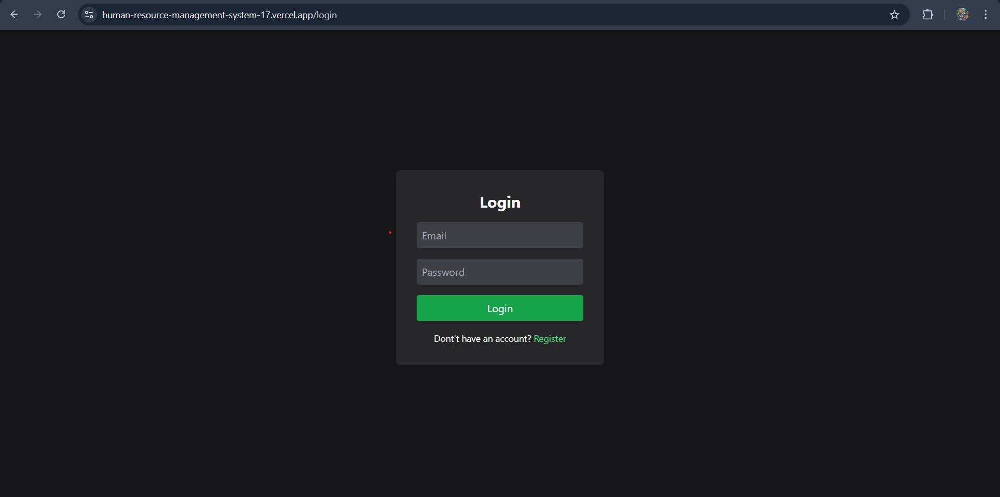
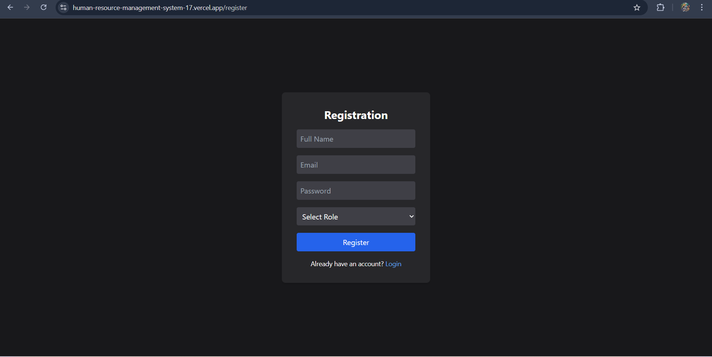
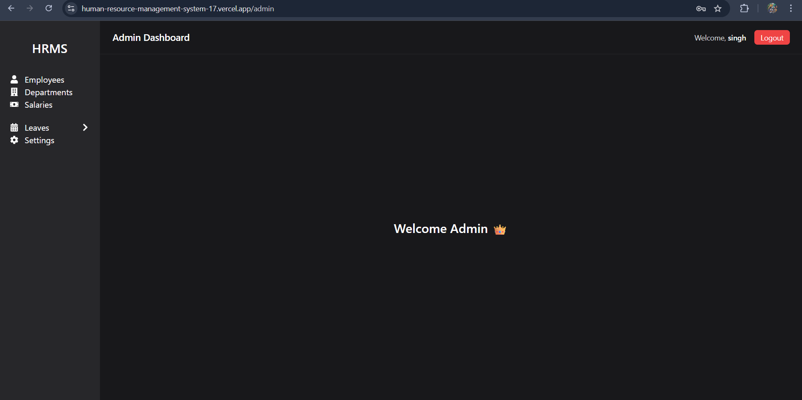
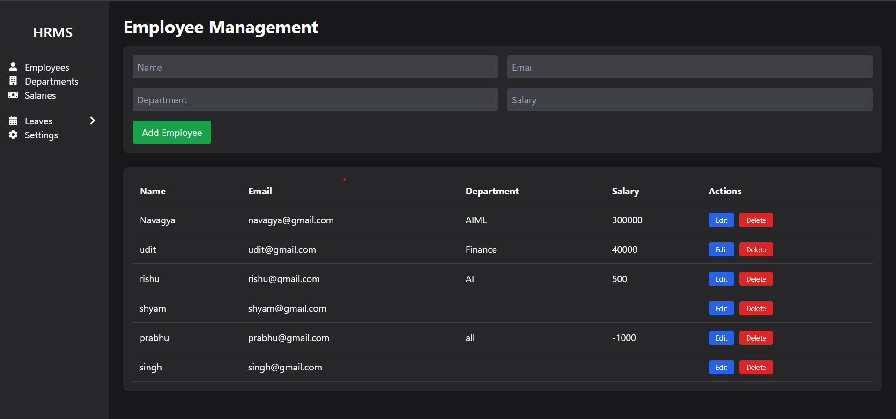
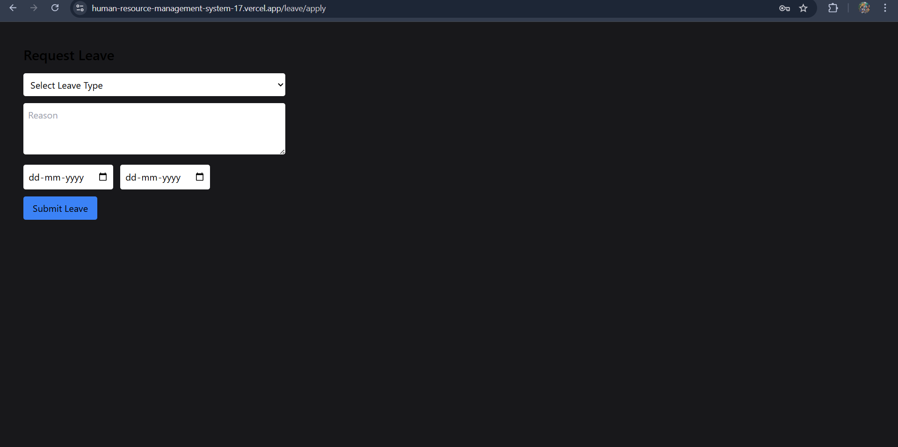
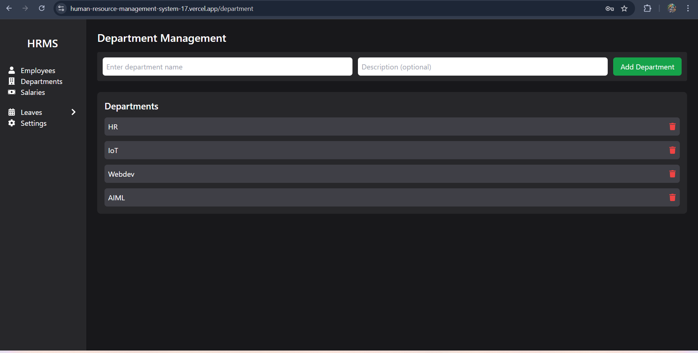
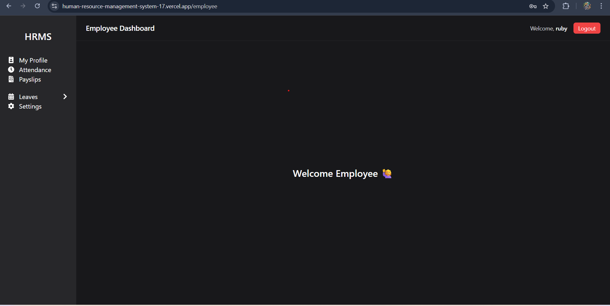
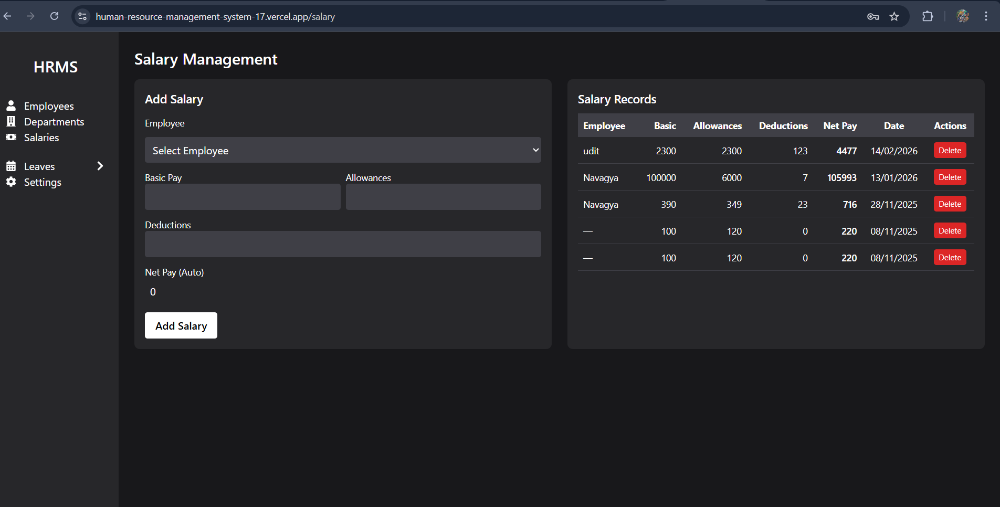

🏢 Human Resource Management System (HRMS)

A full-stack Human Resource Management System built using the MERN stack to manage employee records and administrative operations.

This project simulates a real-world internal HR tool used by organizations to handle employee data, authentication, and management workflows efficiently.

🌐 Live Demo

🔹 Frontend: https://human-resource-management-system-17.vercel.app

🔹 Backend API: https://human-resource-management-system-backend-b1md.onrender.com

🛠 Tech Stack
🔹 Frontend

React.js (Vite)

Tailwind CSS

Axios

React Router

🔹 Backend

Node.js

Express.js

JWT Authentication

bcryptjs

🔹 Database

MongoDB (MongoDB Atlas)

Mongoose

🔹 Deployment

Frontend: Vercel

Backend: Render

✨ Features

🔐 Secure JWT-based Authentication (Login / Signup)

👤 Role-Based Access Control (Admin / Employee)

➕ Add, Edit, Delete Employees (CRUD Operations)

📋 Manage Employee Profiles & Details

🔎 Search & Filter Employees

📊 Admin Dashboard

🔄 RESTful API Architecture

💾 MongoDB Database Integration

🌍 Full Production Deployment (Frontend + Backend)

📸 Screenshots

🔐 Login Page 

🔐 Registration Page 

📊 Admin Dashboard

👥 Employee Management

📋 Apply leave

Department

📊 Employee Dashboard

Salary

⚙️ Installation (Run Locally)
1️⃣ Clone Repository
git clone https://github.com/Navagya/Human-Resource-Management-System
cd Human-Resource-Management-System

2️⃣ Backend Setup
cd backend
npm install
npm run dev

3️⃣ Frontend Setup
cd frontend/hrmsFrontend
npm install
npm run dev

🔐 Environment Variables
Backend .env
MONGO_URI=your_mongodb_connection_string
JWT_SECRET=your_secret_key
PORT=5000

Frontend .env
VITE_API_URL=https://human-resource-management-system-backend-b1md.onrender.com

📚 What I Learned

Designing secure authentication using JWT

Implementing role-based authorization

Building REST APIs with Express.js

MongoDB schema design using Mongoose

Connecting frontend and backend in production

Managing environment variables securely

Debugging deployment issues

Implementing CI/CD using GitHub + Vercel + Render